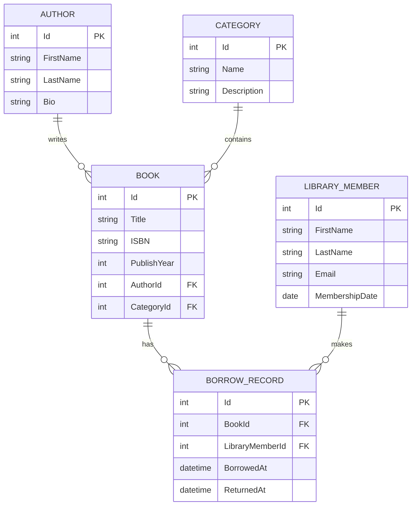

```mermaid
erDiagram
AUTHOR ||--o{ BOOK : writes
CATEGORY ||--o{ BOOK : contains
BOOK ||--o{ BORROW_RECORD : has
LIBRARY_MEMBER ||--o{ BORROW_RECORD : makes

AUTHOR {
    int Id PK
    string FirstName
    string LastName
    string Bio
}

CATEGORY {
    int Id PK
    string Name
    string Description
}

BOOK {
    int Id PK
    string Title
    string ISBN
    int PublishYear
    int AuthorId FK
    int CategoryId FK
}

LIBRARY_MEMBER {
    int Id PK
    string FirstName
    string LastName
    string Email
    date MembershipDate
}

BORROW_RECORD {
    int Id PK
    int BookId FK
    int LibraryMemberId FK
    datetime BorrowedAt
    datetime ReturnedAt
}

%% A book is available when it has no open borrow record (ReturnedAt is null).

```

